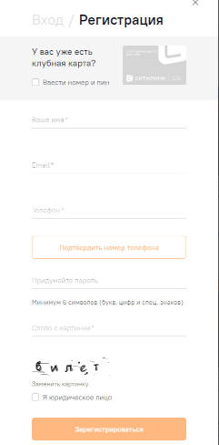
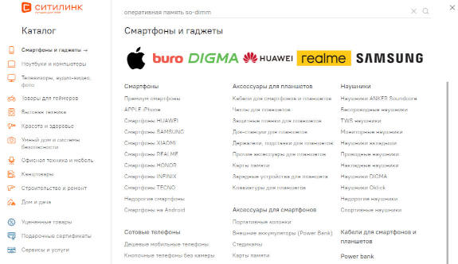
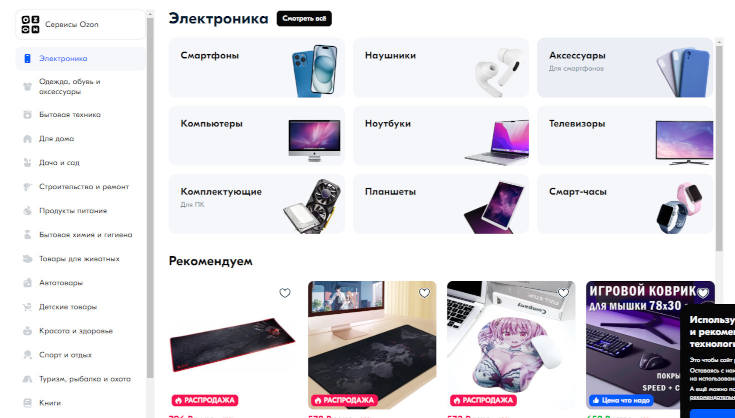
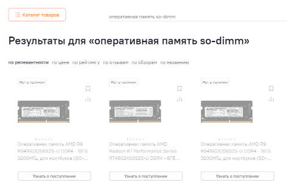
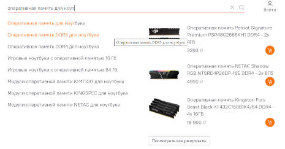

# Урок 1. Формирование гипотез и их скоринг на основе данных
## Задание 1
**Выберите любой продукт. Например ваш продукт:**
* **ozon.ru**
* **citilink.ru**
* **telegram**

**Какие бы ключевые метрики вы выделили? Опишите почему вы выбрали именно их и можно ли их измерить**

Ключевые метрики для интернет-магазина citylink.ru

***Метрики оборота***

1. *Доход*. Для ритейла — ключевая метрика. Чем больше, тем лучше. Получаем через CRM.
2. *Доход с когорты.* Позволяет размер дохода с разных групп пользователей и строить на этом либо стратегию развития и привлечения, либо стратегию удержания лояльных пользователей. Получаем через CRM, если в CRM покупатели категоризированы.
3. *ARPU. Средний доход на одного пользователя в когорте.* Чем выше, тем лучше. Является в том числе показателем качества и удовлетворенности сервисом. Citylink предлагает как товары повседневного спроса, так и товары длительного использования. В первом случае ARPU будет очевидно невысоким, в то время как во втором случае будет относительно высоким. Без учета когорт ARPU для маркетплейса будет не очень информативен. Получаем через CRM, если в CRM покупатели категоризированы.
4. *Количество покупок на когорту*. Позволяет отследить активность покупателей различных групп. Необходимо использовать эту метрику совместно ARPU. Также как и с ARPU этот показатель очень зависит от когорты. В товарах повседневного спроса количество покупок будет высоким, но ARPU будет низким. В товарах длительного использования — наоборот. Получаем через CRM, если в CRM покупатели категоризированы.

***Операционные издержки***

COGS, Acquiring, Ops costs, Overheads. Отслеживаются в CRM. В обычной ситуации для A/B-тестирования не используются.

***Метрики маркетинга***
1. *MAU. Количество уникальных пользователей в месяц.* Ситилинк — магазин электроники и бытовой техники. Покупки совершаются не в ежедневном режиме, но так или иначе регулярно, хотя и не часто. Поэтому отслеживать количество пользователей в ежедневном или еженедельном режиме смысла нет. Но контролировать количество пользователей, посетивших площадку раз в месяц важно, при этом учитывать сезонные факторы. MAU, с учетом сезонных поправок не должен падать. Метрика отслеживается через Яндекс.Метрику или Google Анатилику.
2. *Количество уникальных пользователей в месяц в когортах.* У Ситилинка есть определенная история бренда. С одной стороны, необходимо привлекать новую аудиторию, с другой стороны, не потерять старую. MAU показывает «среднюю температуру по больнице», что может быть не всегда информативно, и, к примеру, не демонстрирует рост интереса к новой категории товаров, недавно появившейся в магазине и при этом потерю интереса преданной аудитории к давно существующей категории товаров. Кроме того, популярные категории товаров желательно сделать доступными наиболеее простыми способами. С другой стороны, непопулярные категории товаров нужно либо продвигать каким-то образом, либо что-то менять в ней, если интерес падает. Метрика отслеживается через Яндекс.Метрику или Google Аналитику с привлечением данных из CRM.
3. *Конверсия в регистрацию.* Гость маркетплейса, прошедший регистрацию, уже в некоторой степени «привязывается» к торговой площадке и его легче реактивировать по телефону, электронной почте или каким-нибудь иным способом, нежели посетителя, который ушел с площадки без регистрации. Отслеживается через Яндекс.Метрику или Google Аналитику.
4. *Конверсия в использование поиска.* Чем выше этот показатель, тем выше вовлеченность посетителя магазина в приобретение товара. Клиент, воспользовавшийся поиском заинтересован в приобретении товара. Этот покаатель долже быть чем выше, тем лучше. Отслеживается через Яндекс.Метрику или Google Аналитику.
5. *Конверсия в использование каталога.* Аналогично поиску. Если клиент начинает перемещаться по страницам каталога, то это означает, что он заинтересован в приобретении товара сейчас или в обозримом будущем. Этот показатель должен быть чем выше, тем лучше. Отслеживается через Яндекс.Метрику или Google Аналитику.
6. *Ключевые слова поиска.* Демонстрирует интерес посетителей к определенным видам товара. Отслеживается через Яндекс.Метрику или Google Аналитику.
7. *Conversion Rate. Конверсия в покупку*. Процент посетителей маркетплейса, совершивших покупку. Падение конверсии анализируется совместно с другими метриками. Но основа в любом случае состоит в том, что сем выше конверсия, тем лучше. Отслеживается через Яндекс.Метрику или Google Аналитику или CRM.

Через CRM и связь с онлайн сервисами аналитики можно отследить метрики стоимости лида, реактивации пользователя. Кроме того, отслеживать конверсию маркетинговых мероприятий, маркетинговый бюджет и т. п

## Задание 2
**Сформулируйте 5—10 гипотез для выбранного продукта.**

1. Упрощенная форма регистрации пользователя увеличит конверсию в регистрации.
На данный момент пользователь должен ввести имя, электронную почту, телефон, придумать пароль и ввести капчу (рис. 1). На самом деле ничего этого делать не нужно, если ограничиться номером телефона с активацией его по СМС. Предложить ввести имя, электронную почту и всю остальную необхдимую информацию пользователь сможет при оформлении первого заказа. Но после такой упрощенной регистрации в маркетплейсе у нас уже будет контактная информация.

Рис. 1. Форма регистрации нового пользователя в маркетплейсе Citylink

2. Выделение формы поиска с помощю анимированного или яркого элемента увеличит конверсию в использование поиска. Форма поиска расположена в правильном месте, но она сишком незаметная. Пустая серая строка на белом фоне. Не обязательно делать ее кричащей или яркой, но можно как-то попробовать ее выделить.

3. Реорганизация каталога увеличит конверсию пользователей, которые воспользовались каталогом. Сейчас каталог перегружен мелкими категориями, и сходу обычному пользователю в нем сложно ориентироваться. В нужную категорию можно попасть в один клик, но от этого каталог перегружен (рис. 2). Оформление каталога, аналогичное тому, что есть у Ozon, с карточками категорий и их изображениями, а не текстом (рис. 3), увеличит конверсию.

Рис. 2. Организация каталога товаров в маркетплейсе Citylink

Рис. 3. Организация каталога товаров в маркетплейсе OZON

4. Перенастройка выдачи результатов поиска повысит конверсию в покупку. Сейчас алгоритмы маркетлпейса работают странно. Так, поисковый запрос «оперативная память для ноутбука» или «оперативная память so-dimm» возвращют три позиции, которые отсутствуют в продаже (рис. 3). При этом в каталоге есть разделы «оперативная память DDR5 для ноутбука» и «оперативная память DDR4 для ноутбука» (рис. 4), где товарные позиции в продаже есть. Не исключено, что аналогичная ситуация происходит с другими запросами.

Рис. 4. Отсутствие результатов поиска товара, присутствующего в Маркетплейсе

Рис. 5. Синонимичные категории товаров, которые находятся по другому запросу

5. Размещение информации о возможности кредитования и его условиях в верхней части страницы увеличит конверсию в продажи. Сейчас информация о возможности кредитования расположена в футере и разделе о способах оплаты. Отсутствует информация о возможности получения кредита и на странице корзины.