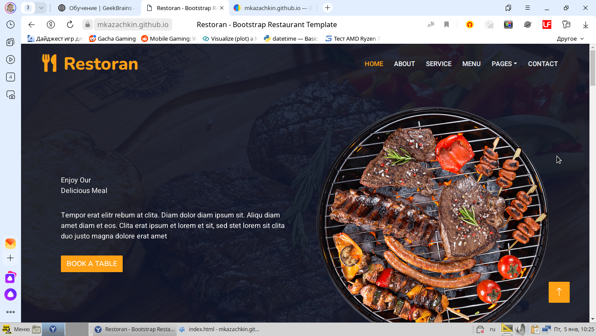
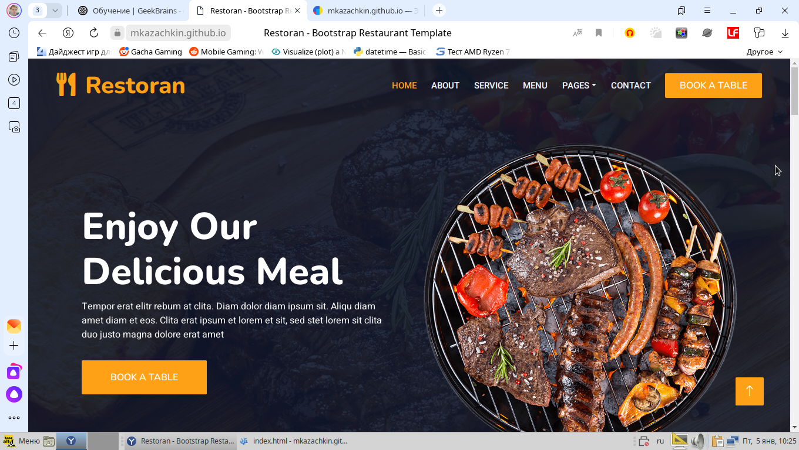
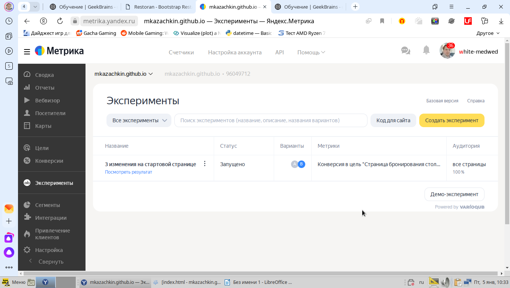
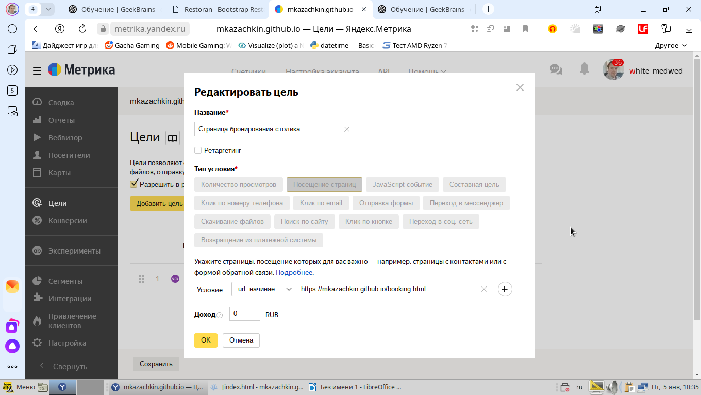
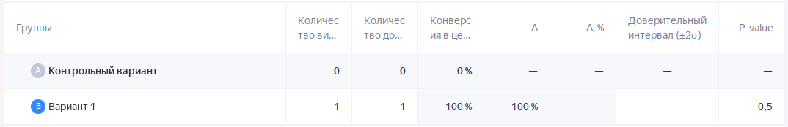

# Урок 3. A/B-тестирование веб-приложений

[Ссылка на тестовый сайт](https://mkazachkin.github.io/index.html)

## Вариант A
Базовый

Базовый облик страницы

## Вариант B
1. Добавлена кнопка бронирования столика рядом с меню
2. Увеличен размер заголовка
3. Увеличена кнопка бронирования столика

Новый облик страницы

## AB-тестирование
Метрика: конверсия в цель «Страница бронирования столика»

Скриншот настроенного AB-эксперимента

Скриншот настроенной цели

Проведение AB-тестирования