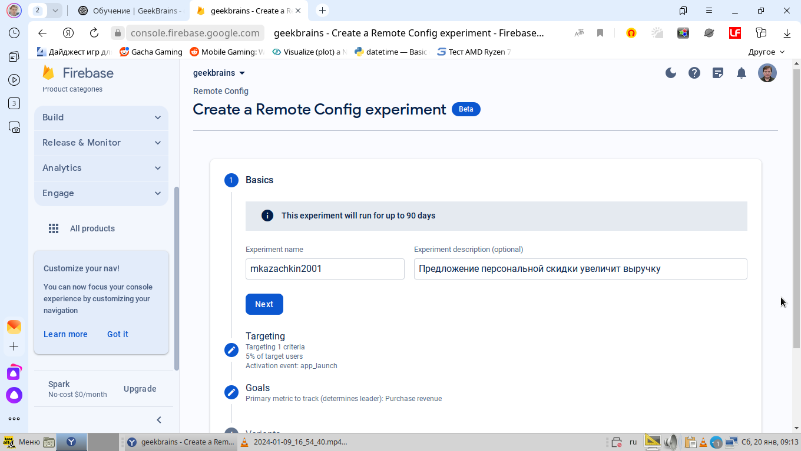
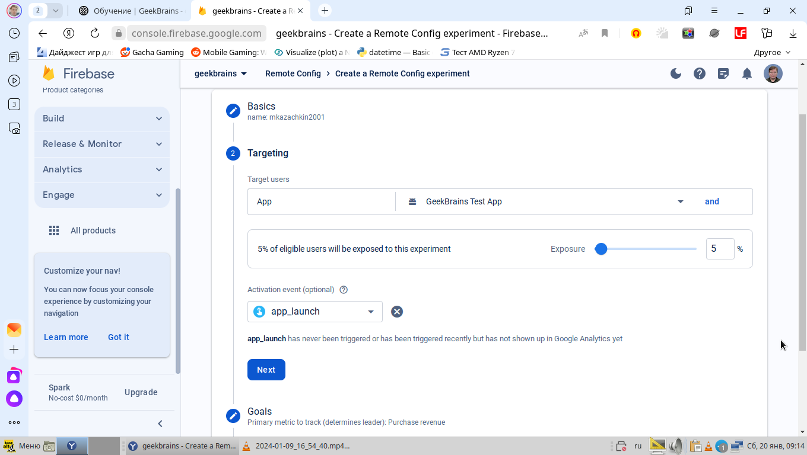
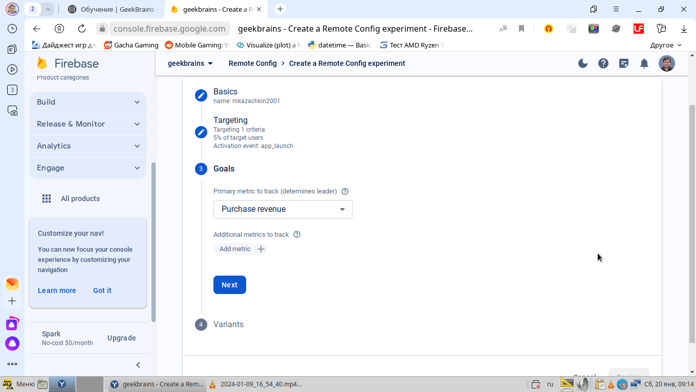
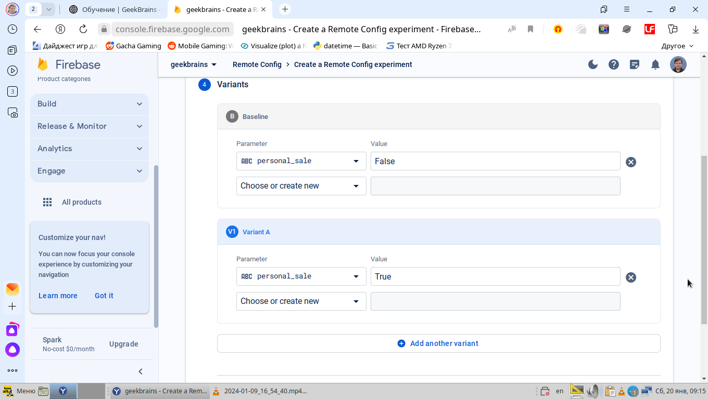
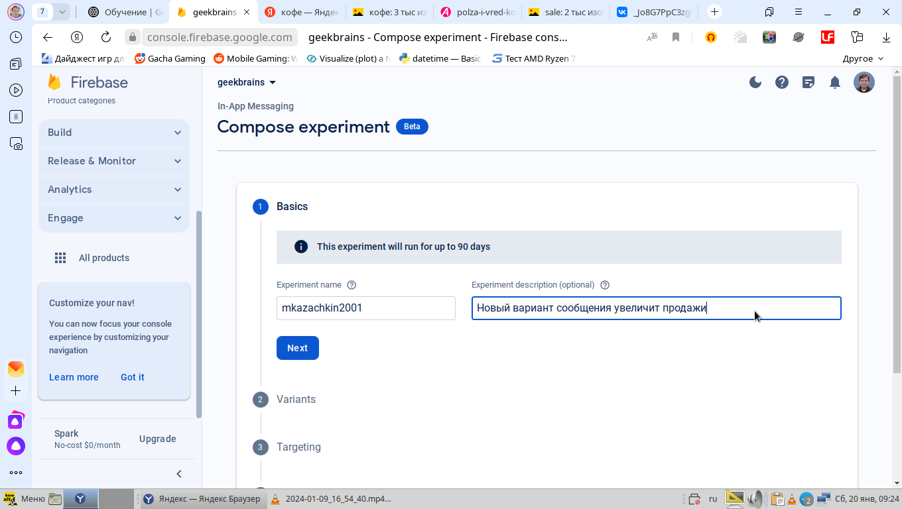
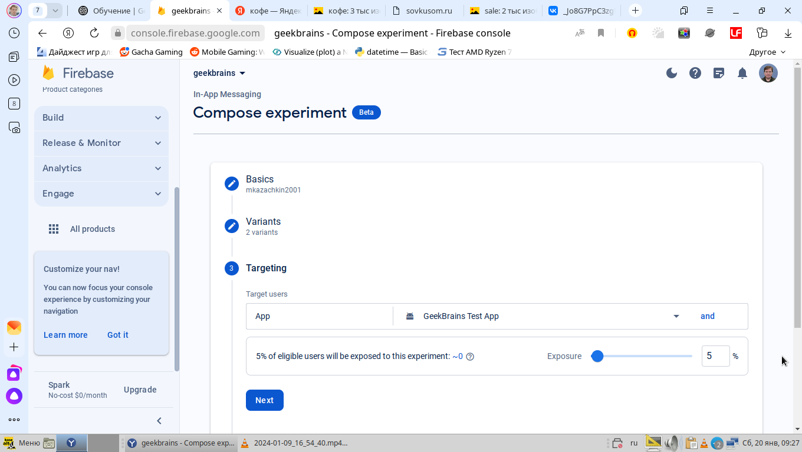
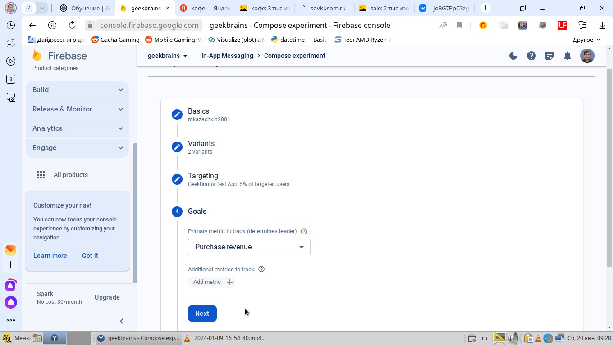

# Урок 4. A/B-тестирование мобильных приложений

## Remote config

Создание A/B эксперимента и его описание

Выбор приложения для проведения A/B эксперимента условия его запуска в приложении

Выбор целевой метрики A/B эксперимента

Целевые значения переменной для варианта A и B

## In-app сообщения

Создание A/B эксперимента и его описание

 варианта сообщения в приложении")
Создание базового (A) варианта сообщения в приложении

 варианта сообщения в приложении")
Создание альтернативного (B) варианта сообщения в приложении

Выбор тестового приложения и настройка процента аудитории для теста

Выбор целевой метрики

Настройка сроков проведения A/B эксперимента
